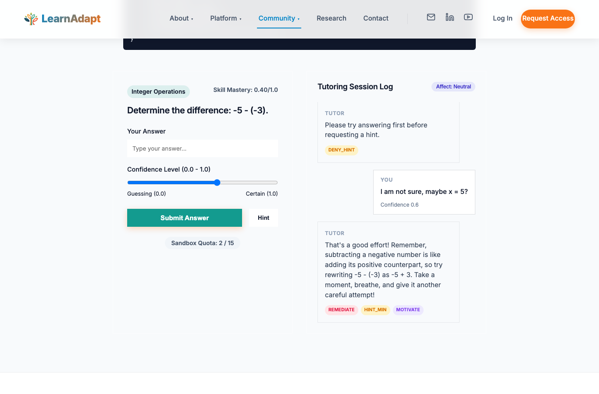

# From Untamed Black Box to Interpretable Pedagogical Orchestration 

[](https://colab.research.google.com/github/nizamkadirteach/aied2026-es-llms/blob/main/demo.ipynb)
[](https://opensource.org/licenses/MIT)

**Official Open-Source Toolkit & Reproducibility Repository for the AIED 2026 Paper (ES-LLMs)**

This repository provides an extensible research toolkit outlining the **Ensemble of Specialized LLMs (ES-LLMs)** architecture. By decoupling deterministic pedagogical decision-making from natural language generation, ES-LLMs enforces strict "attempt-before-hint" rules, solving the Mastery Gain Paradox common to monolithic AI tutors. A live, interactive web demonstration of the ES-LLMs tutoring sandbox is also available!

---

## 🛠️ The Research Toolkit

This repository is designed to help learning science researchers evaluate, simulate, and benchmark LLM-based intelligent tutoring systems.

1. **`/benchmark`**: 
   - Contains the **ES-LLMs Pedagogical Safety Benchmark**, an expert-curated 24-scenario JSON dataset testing for edge cases like "Hint Abuse" and "Off-topic distraction." Use this to evaluate if your novel LLM tutor is easily gamed by students.
2. **`/simulator`**: 
   - A Monte Carlo simulation environment (`synthetic_students.py` and `simulation_loop.py`). We provide the precise probabilistic parameters for 4 empirical student archetypes (Struggling, Low, Average, High) derived from BKT equations on the ASSISTments dataset. Run massive N=2,400 stochastic sessions locally.
3. **`/evaluator`**: 
   - The strict **Multi-LLM Evaluator**. Use `eval_rubric_prompts.json` and `llm_judge_panel.py` to leverage 6 frontier models (Gemini, Qwen, Kimi, etc.) to automatically grade your own dialogue logs on our 7-dimensional pedagogy rubric.
4. **`/metrics`**: 
   - `metrics.py` calculates novel conceptual metrics from our paper, notably **Hint Efficiency** ($\text{Mastery Gain} / \text{Hints Received}$) and **Procedural Fairness** (Constraint Adherence).
5. **`/evaluation`**:
   - Contains the **Human Expert Evaluation Rubrics** (`HUMAN_EVALUATION_RUBRICS.md`). This formal 7-dimension Likert scale was exactly as presented to our 6 human expert judges to evaluate Adaptivity, Scaffolding, Ethical Reasoning, and Trust.
6. **`/examples`**:
   - Contains anonymized transparency datasets (e.g. human expert panel evaluation scores and unedited high-throughput N=2,400 Monte Carlo simulation results) directly mapping to the paper's quantitative results.
7. **`/agents`**:
   - The core Subsumption Architecture logic. Review `orchestrator.py` to see the hierarchical arbitration engine (Safety > Assessment > Feedback > Scaffolding > Motivation) and `stateless_renderer.py` for the final single-prompt linguistic generation step.

## 🚀 Quick Start (Google Colab)
Want to instantly see how the Subsumption Architecture suppresses harmful AI generations? Click the **Open in Colab** badge at the top of this file to run a minimal, executable demonstration of our EthicsBot overriding a premature hint request directly in your browser.

## 🌐 Public Sandbox (Live Demo)

Experience the Ensemble of Specialized LLMs (ES-LLMs) architecture in action through our public interactive sandbox. 

[](https://learnadaptresearch.org/aied2026)

**[Try the Live ES-LLMs Sandbox Here](https://learnadaptresearch.org/aied2026)**

## 👥 Author & Citation

* **Nizam Kadir** [[ORCID: 0000-0002-6725-1133]](https://orcid.org/0000-0002-6725-1133) (Corresponding Author: `nizam_kadir@mymail.sutd.edu.sg`)

*Singapore University of Technology and Design, Singapore 487372, Singapore*

If you build upon this architecture or utilize the pedagogical ruleset in your research, please click 'Cite this repository' on the right sidebar, or use the AIED 2026 preprint citation below:

```bibtex
@misc{kadir2026untamedblackboxinterpretable,
      title={From Untamed Black Box to Interpretable Pedagogical Orchestration: The Ensemble of Specialized LLMs Architecture for Adaptive Tutoring}, 
      author={Kadir, Nizam},
      year={2026},
      eprint={2603.23990},
      archivePrefix={arXiv},
      primaryClass={cs.CY},
      url={https://arxiv.org/abs/2603.23990}, 
      doi={10.48550/arXiv.2603.23990}
}
```

## ⚖️ License
This repository is released under the permissive [MIT License](LICENSE), explicitly allowing educational/EdTech startup and academic R&D integration.
